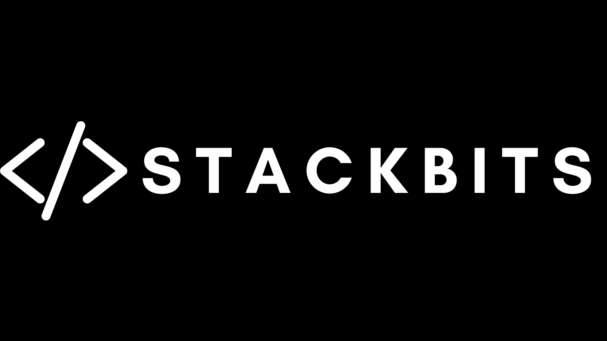
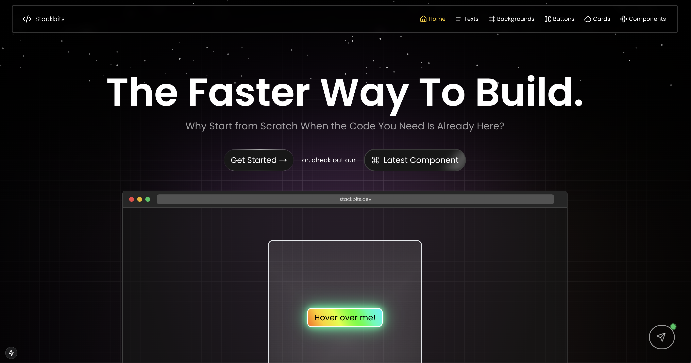
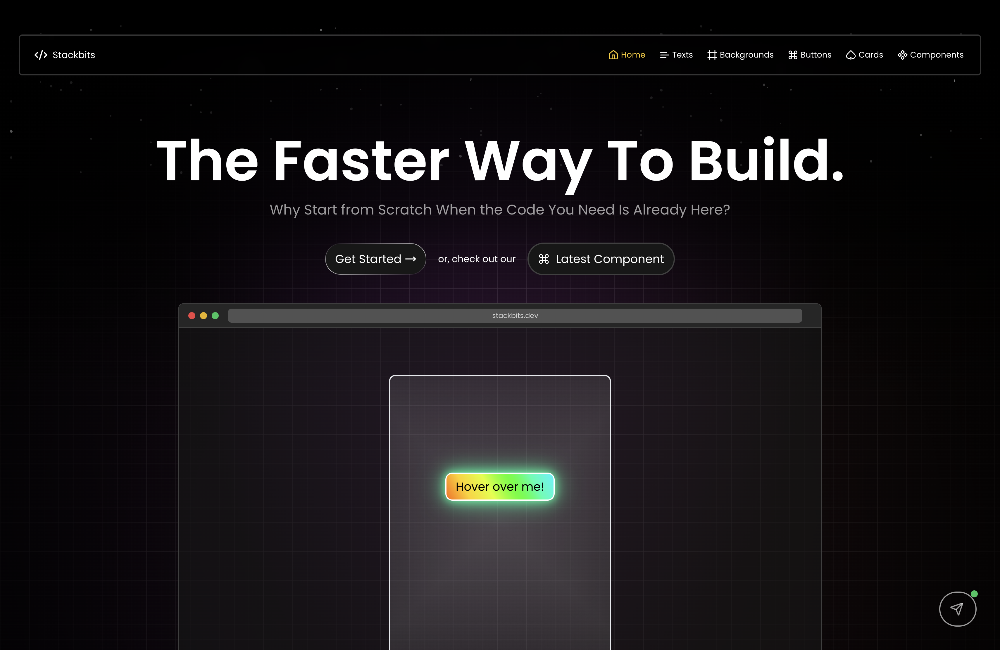
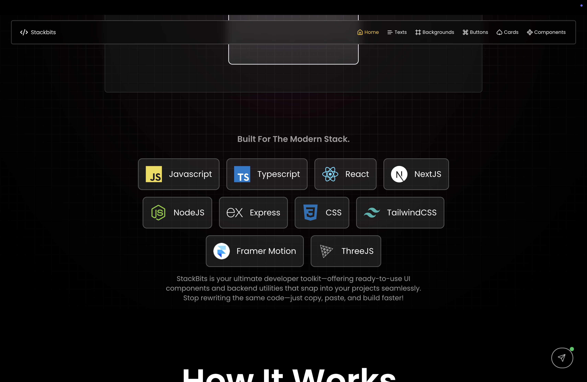
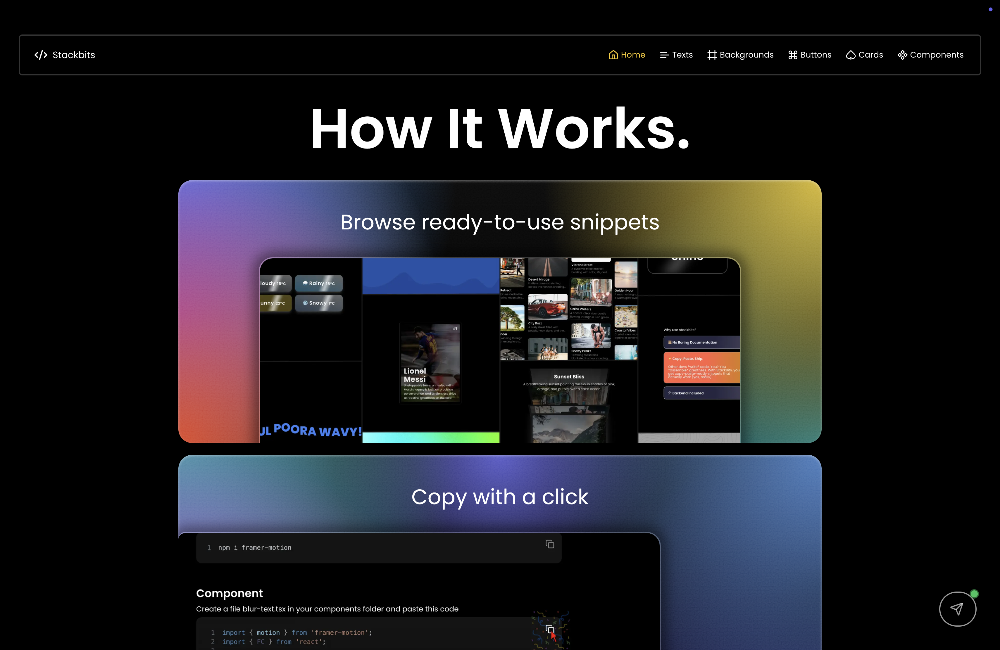
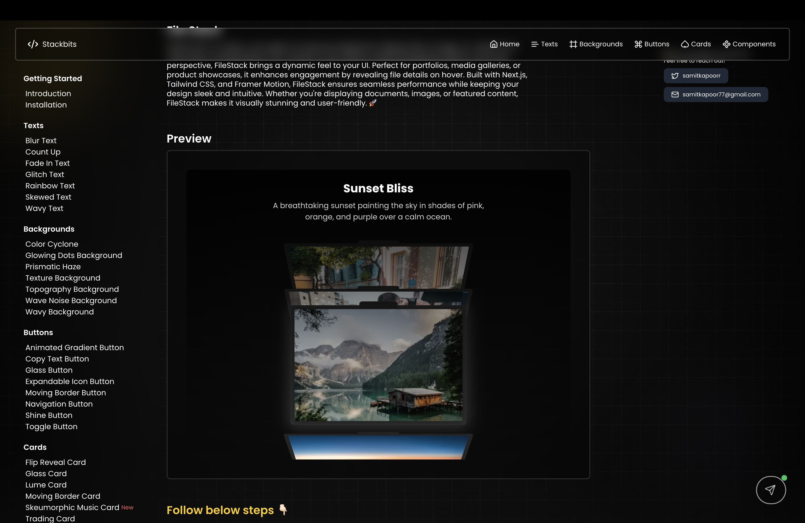
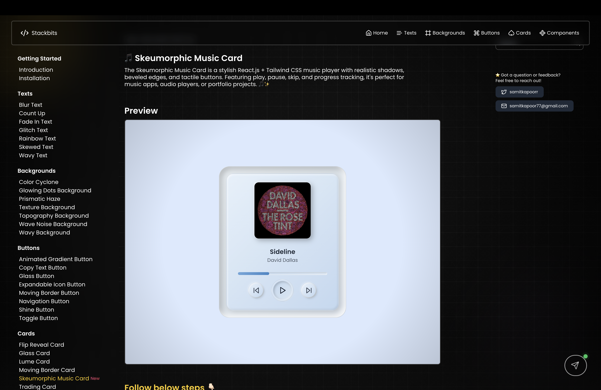
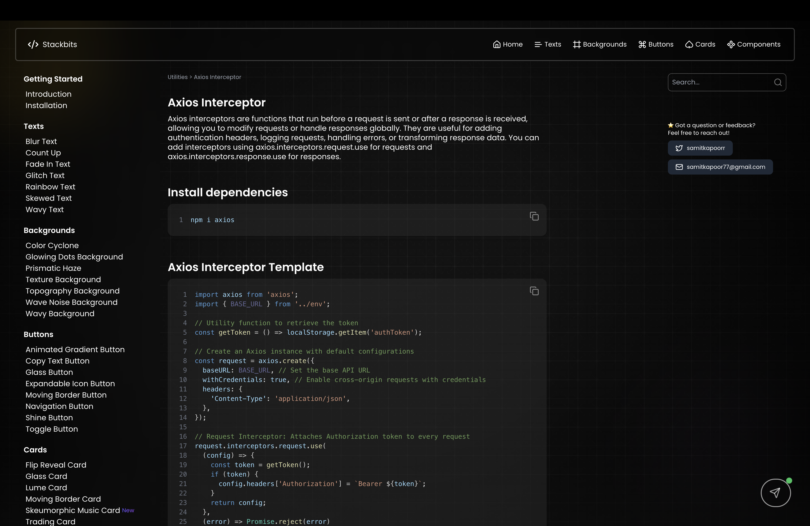
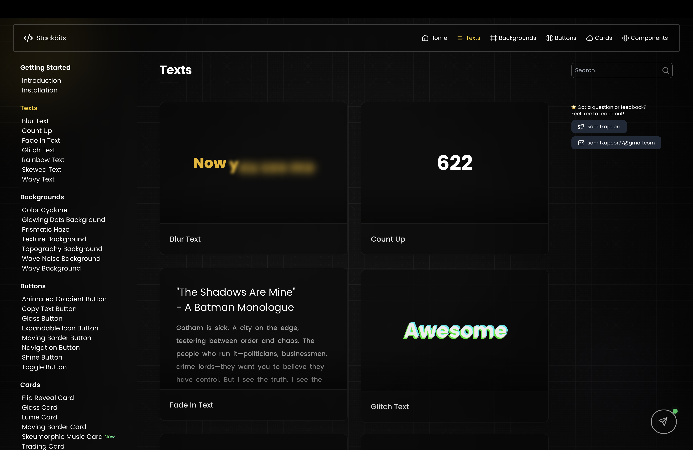
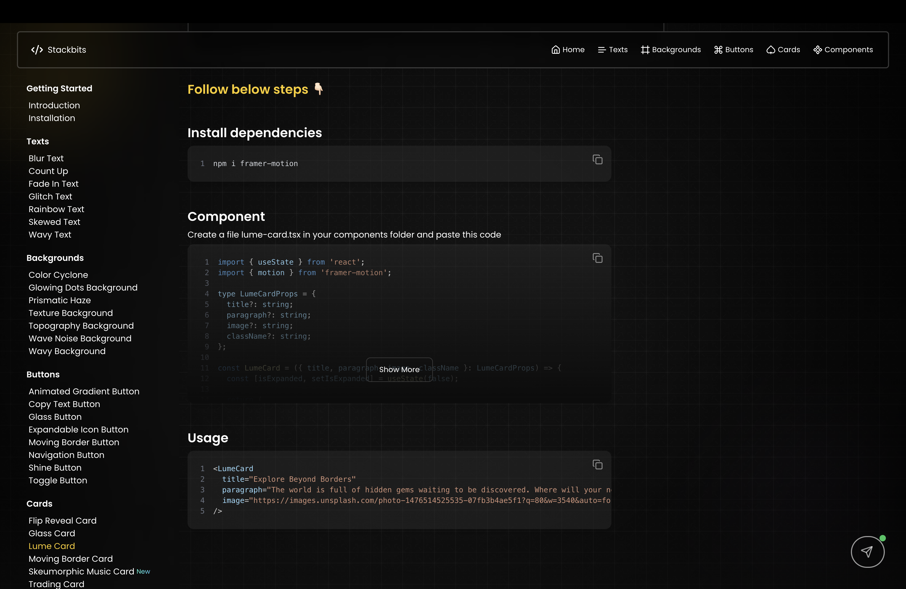

# StackBits

A collection of high-quality, reusable **frontend and backend components** to speed up development. Built with **Next.js, Tailwind CSS, and TypeScript**, StackBits provides ready-to-use UI elements and utility functions to simplify your workflow.

Enhance your projects with **modern design, optimized performance, and developer-friendly components** so you can focus on building, not reinventing the wheel.

🔗 **Live Demo:** https://stackbits.dev  

---

## ✨ Features

- ⚡ **Write Less Code, Build More** - Pre-built components to speed up development
- 🎨 **Tailwind-Powered Styling** - Clean, modern, and fully customizable
- 🚀 **Optimized for Performance** - Fast-loading and lightweight components
- 📦 **Reusable & Scalable** - Designed for easy integration in any project
- 🔧 **Backend Utilities** - Essential functions like authentication, encryption, and API handlers

---

## 🛠️ Tech Stack

- ⚛️ **[React](https://react.dev/)** - Component-based UI development
- 🚀 **[Next.js](https://nextjs.org/)** - Optimized rendering and performance
- 🎨 **[Tailwind CSS](https://tailwindcss.com/)** - Utility-first styling for rapid design
- 💫 **[Framer Motion](https://www.framer.com/motion/)** - Smooth animations and transitions
- 📜 **[TypeScript](https://www.typescriptlang.org/)** - Type-safe and scalable codebase
- 🛠️ **[Node.js](https://nodejs.org/)** - Backend support for server-side utilities

---

## 📸 Project Gallery

|   |  |  |
| --------------------------------------------------------- | -------------------------------------------------------- | -------------------------------------------------------- |
|   |  |  |
|  |  |  |

---

## 🤝 Contributing

Contributions are welcome! Here's how you can contribute:

- Open an issue and get assigned to it.
- Fork the repository.
- Create a new branch for your feature or bug fix.
- Make your changes and commit them with descriptive messages.
- Push your changes to your fork.
- Submit a pull request to the main branch of the original repository.
  Please ensure your code adheres to the project's coding standards and includes appropriate tests

## ⭐ Like This Project?

If you found this project useful or inspiring, consider giving it a **⭐ star!**

📌 You can check out more of my projects on my **[GitHub profile](https://github.com/samitkapoor)**.  
🌍 Visit my **[portfolio](https://samitkapoor.com)** to see my work and get in touch!

---
